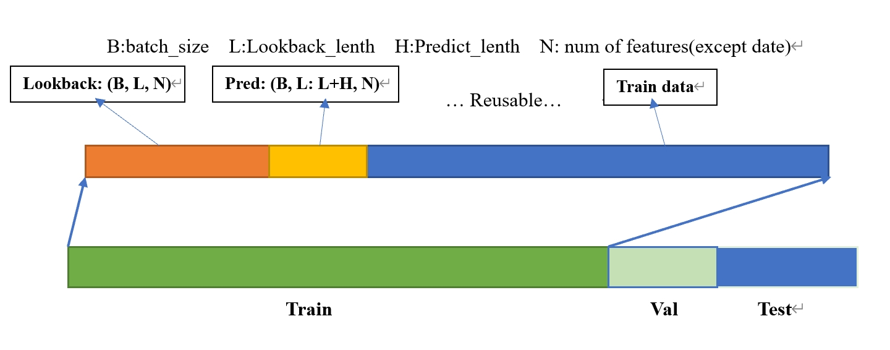
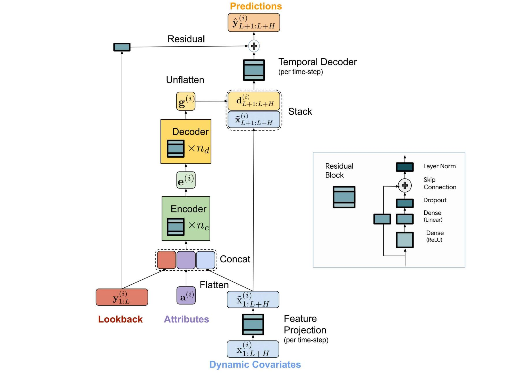
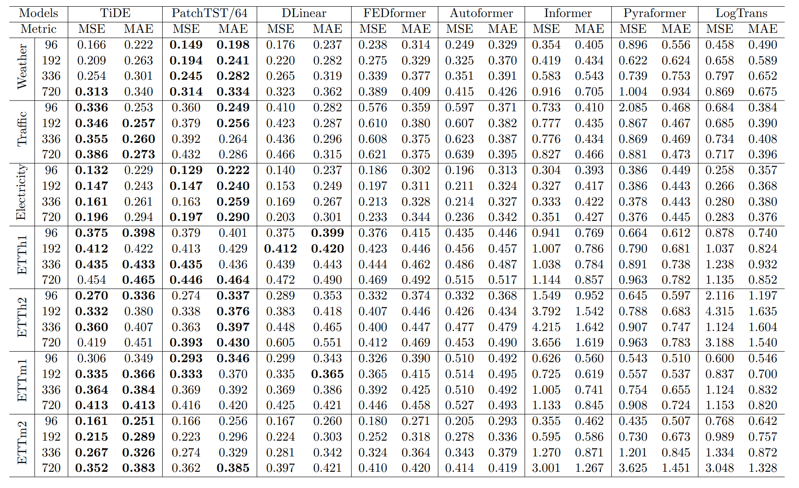
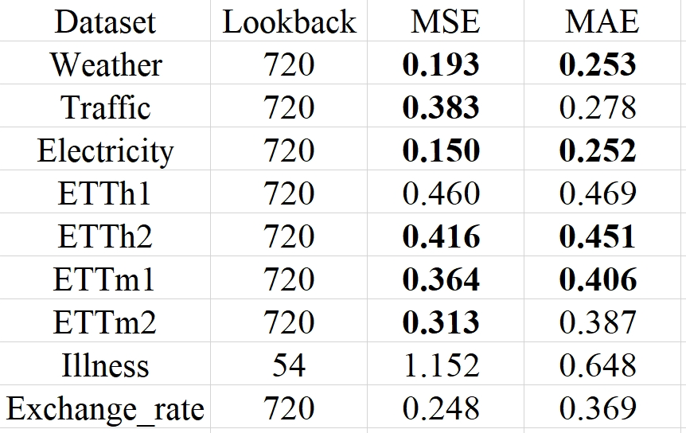
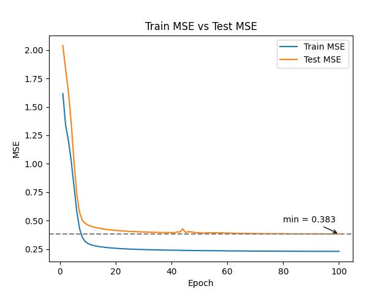
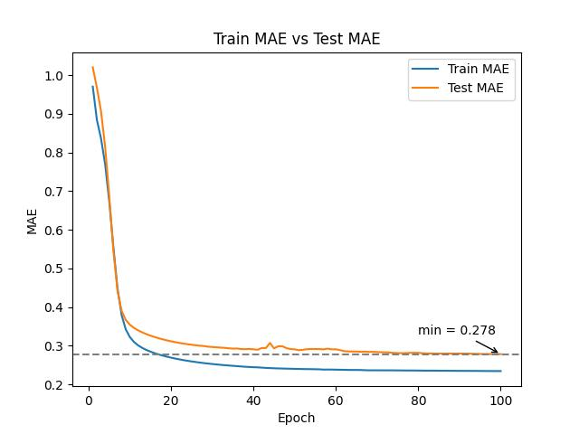
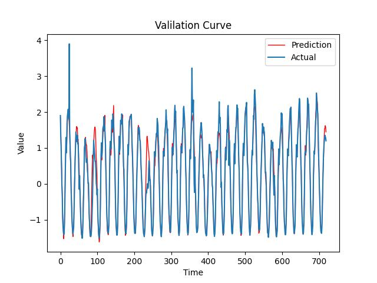
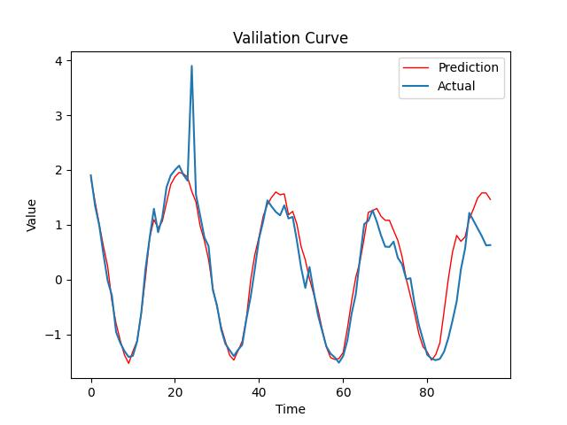
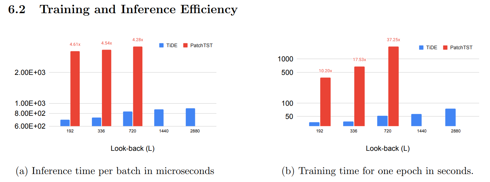

# Google_TiDE_implementation
An unoffical pytorch implementation of (Google）Long-term Time Series Forecasting with TiDE: Time-series Dense Encoder \
Link to paper: [Long-term Forecasting with TiDE: Time-series Dense Encoder](https://arxiv.org/pdf/2304.08424.pdf) \
Official implemention:(https://github.com/google-research/google-research/tree/master/tide)
## Data Pre-process
[[Dataset](https://huggingface.co/datasets/ym0v0my/Time_series_dataset)]
### Patching 
The core idea of this data pre-process is Patching, which is similar to PatchTST and many other time series forcasting jobs. Specifically, they both divide the time series into a number of time segments, each of which is considered a token .

In contrast to PatchTST and some MLP-based forecasting models, it makes use not only of past series values (LookBack) but also of information on covariates such as static covariates (Attributes, No change in relative time) and dynamic covariates (Dynamic Covariates) that are known at any point in time(Like holiday, hour, day etc).
 

## Net Framework

The overall architecture of the TiDE model is shown in the diagram above. Like PatchTST, it assumes that the channels are independent. This means that multivariate forecasting is transformed into multiple univariate forecasts with shared model parameters.

In the last hyperparameters table of Paper, each dataset has a different network structure, I tried other network structures also have strong generalisation, Maybe not so SOTA. 
## Metric Result

### My Result
#### MSE and MAE Table
 

#### Traffic MSE and MAE (traget)
  

#### Traffic Val Curve
**Predict 720 steps and 96 steps (after data scale transform)**

  

## Summary

With about the same performance as PatchTST, TiDE is very efficient. As shown below, both inference and training times are very fast, and the space complexity is low enough to handle very long sequences without out of memory (only use a T4 GPU).

 

### Last
This study shows that self-attention might not be necessary to learn the periodicity and trend patterns at least for these long-term forecasting benchmarks.

## Reference:
[https://github.com/google-research/google-research/tree/master/tide]( https://github.com/google-research/google-research/tree/master/tide) 

[https://github.com/yuqinie98/PatchTST]( https://github.com/yuqinie98/PatchTST) 

[https://zhuanlan.zhihu.com/p/624828590]( https://zhuanlan.zhihu.com/p/624828590) 

[https://github.com/zhouhaoyi/Informer2020]( https://github.com/zhouhaoyi/Informer2020) 

[https://github.com/HenryLiu0820/TiDE]( https://github.com/HenryLiu0820/TiDE) 

